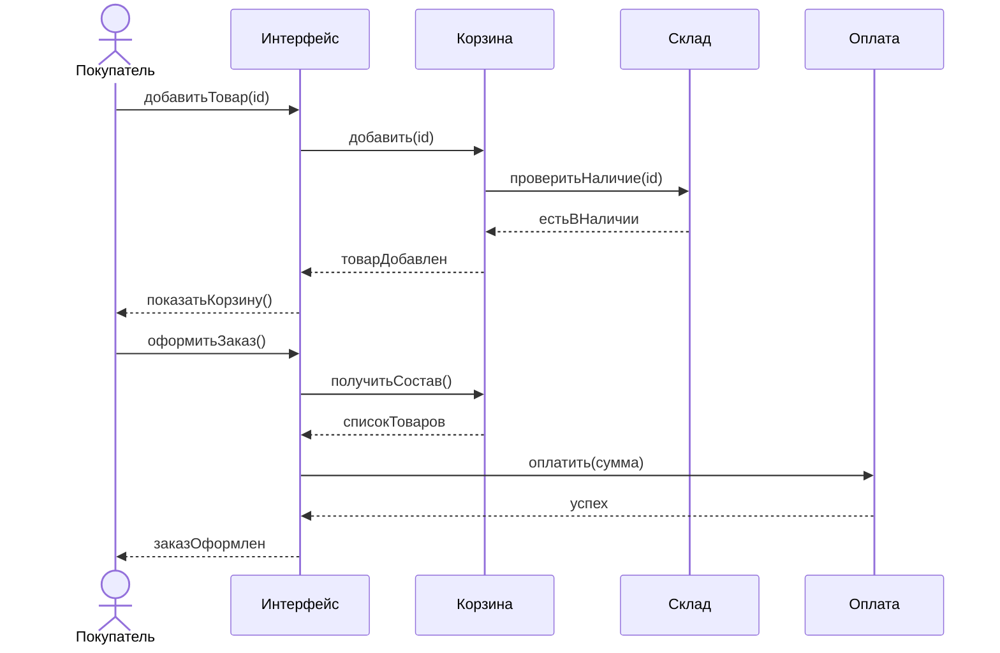
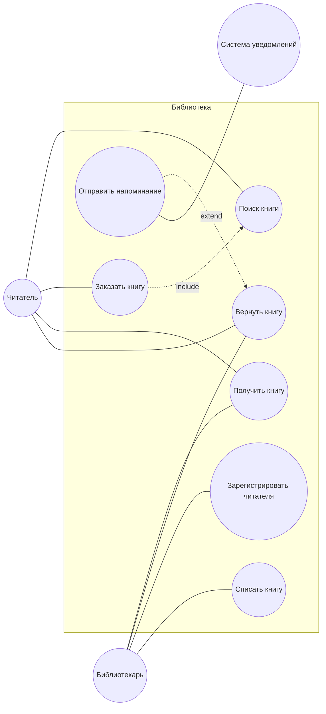
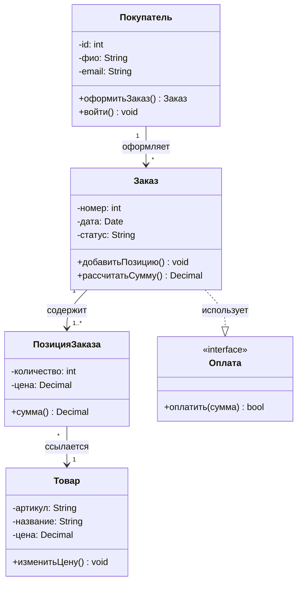
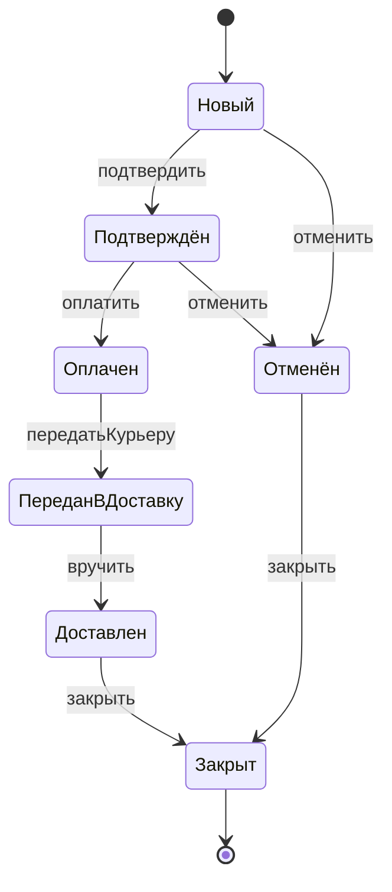

# Контрольная работа — «Технология разработки программного обеспечения»
## Ответы на все варианты (курс 4, группа №243)

---

# ВАРИАНТ 1

## Задание 1. Жизненный цикл ПО (3–4 балла)

**Жизненный цикл программного обеспечения (ЖЦ ПО)** — это период времени от момента принятия решения о необходимости создания программного продукта до момента его полного изъятия из эксплуатации. ЖЦ охватывает все процессы: анализ, проектирование, реализацию, тестирование, внедрение, сопровождение и вывод из эксплуатации.

### Основные этапы жизненного цикла ПО

1. **Анализ требований** — выявление и формализация потребностей заказчика и пользователей; формулировка функциональных и нефункциональных требований.
2. **Проектирование** — разработка архитектуры системы, структуры данных, интерфейсов, алгоритмов; создание UML- и других моделей.
3. **Реализация (кодирование)** — написание исходного кода, создание модулей и компонентов согласно проекту.
4. **Тестирование** — проверка соответствия ПО требованиям, поиск и устранение дефектов (модульное, интеграционное, системное, приёмочное тестирование).
5. **Внедрение** — установка ПО у заказчика, обучение пользователей, ввод в промышленную эксплуатацию.
6. **Сопровождение** — исправление ошибок, адаптация к новым условиям, развитие функциональности.
7. **Вывод из эксплуатации** — прекращение поддержки и использования системы (при необходимости — миграция данных).

### Последовательность этапов

```
Анализ требований → Проектирование → Реализация → Тестирование → Внедрение → Сопровождение → Вывод из эксплуатации
```

*(В итеративных и Agile-моделях этапы могут повторяться циклами, но логическая последовательность внутри итерации сохраняется.)*

---

## Задание 2. Диаграмма вариантов использования (5–6 баллов)

**Назначение диаграммы вариантов использования (Use Case Diagram):**  
показать, **кто** взаимодействует с системой и **какие функции** система предоставляет. Диаграмма описывает границы системы с точки зрения пользователей и внешних систем, не раскрывая внутреннюю реализацию.

**Актёр (Actor)** — внешняя по отношению к системе сущность (человек, организация или другая система), которая взаимодействует с системой для достижения цели. Актёр инициирует прецеденты или участвует в них. Обозначается фигурой «человечек» или стереотипом `<<actor>>`.

**Прецедент (Use Case)** — последовательность действий системы, видимая актёру и приводящая к значимому для него результату. Прецедент описывает «что» делает система, а не «как». Обозначается овалом с названием (обычно глагол + объект: «Оформить заказ»).

**Отношение include (включение):**  
обязательное включение поведения одного прецедента в другой. Базовый прецедент **всегда** выполняет включаемый. Используется для выделения общего фрагмента, который повторяется в нескольких прецедентах.  
Стрелка: базовый → включаемый, стереотип `<<include>>`.

**Отношение extend (расширение):**  
условное расширение базового прецедента дополнительным поведением. Расширяющий прецедент выполняется **не всегда**, а при определённом условии (точка расширения).  
Стрелка: расширение → базовый, стереотип `<<extend>>`.

---

## Задание 3. Функциональное и юзабилити-тестирование (7–8 баллов)

**Функциональное тестирование** — вид тестирования, при котором проверяется, соответствует ли поведение ПО заявленным функциональным требованиям: правильно ли система выполняет функции, обрабатывает входные данные, формирует результаты и сообщения об ошибках. Оценивается «что делает» система, а не «как устроена» внутри.

**Юзабилити-тестирование (usability testing)** — вид тестирования удобства использования интерфейса: насколько легко и эффективно пользователь достигает целей, понятны ли элементы управления, насколько интуитивен сценарий работы. Оцениваются понятность, обучаемость, эффективность, удовлетворённость пользователя.

---

## Задание 4. Диаграмма последовательности (9–10 баллов)

**Пример:** оформление заказа в интернет-магазине.

```
Актёр: Покупатель
Объекты: :Интерфейс, :Корзина, :Склад, :Оплата

Покупатель → Интерфейс : добавитьТовар(id)
Интерфейс → Корзина : добавить(id)
Корзина → Склад : проверитьНаличие(id)
Склад --> Корзина : естьВНаличии
Корзина --> Интерфейс : товарДобавлен
Интерфейс --> Покупатель : показатьКорзину()

Покупатель → Интерфейс : оформитьЗаказ()
Интерфейс → Корзина : получитьСостав()
Корзина --> Интерфейс : списокТоваров
Интерфейс → Оплата : оплатить(сумма)
Оплата --> Интерфейс : успех
Интерфейс --> Покупатель : заказОформлен
```

**Как начертить (UML Sequence Diagram):**
1. Слева — актёр «Покупатель», далее объекты с линиями жизни (вертикальные пунктирные линии).
2. Горизонтальные стрелки — сообщения (сплошные — вызов, пунктирные — возврат).
3. На линиях жизни — узкие прямоугольники активации на время обработки.
4. Подписи сообщений: `добавитьТовар()`, `проверитьНаличие()`, `оплатить()` и т.д.



---

# ВАРИАНТ 2

## Задание 1. Функциональное моделирование и IDEF0 (3–4 балла)

**Назначение функционального моделирования:**  
описать систему как набор функций (работ), показать, **что** делает система, какие данные/материалы входят и выходят, чем управляется и какими ресурсами выполняется. Помогает анализировать бизнес-процессы и требования до детального проектирования ПО.

**Состав модели IDEF0:**
- **Блоки (Activity / Function)** — прямоугольники, обозначающие функции (работы). Название — глагол + объект.
- **Стрелки (Arrows):**
  - **Входы (Input)** — слева: объекты, которые преобразуются функцией;
  - **Выходы (Output)** — справа: результаты функции;
  - **Управление (Control)** — сверху: правила, стандарты, ограничения;
  - **Механизмы (Mechanism)** — снизу: ресурсы, исполнители, оборудование, ПО.
- **Иерархия диаграмм** — декомпозиция: A0 → A1, A2… → A11, A12…
- **Глоссарий / текстовое сопровождение** — пояснения к работам и стрелкам.
- **Цель и точка зрения** — обязательные атрибуты модели.

**Контекстная диаграмма (A-0 / контекст):**  
верхний уровень модели IDEF0: **один** функциональный блок, представляющий систему целиком, и внешние стрелки (входы, выходы, управление, механизмы), связывающие систему с окружением. Определяет границы моделируемой системы и её взаимодействие с внешним миром. Дальнейшие диаграммы — декомпозиция этого блока.

---

## Задание 2. Инкапсуляция, наследование, полиморфизм (5–6 баллов)

**Инкапсуляция** — объединение данных и методов, работающих с этими данными, в одном объекте (классе) и сокрытие внутренней реализации от внешнего кода. Доступ к состоянию объекта предоставляется через публичный интерфейс (методы), что повышает надёжность и упрощает изменение реализации.

**Наследование** — механизм ООП, при котором класс-потомок получает свойства и поведение класса-предка и может дополнять или переопределять их. Обеспечивает повторное использование кода и построение иерархий «общее → частное» (например, `Транспорт` → `Автомобиль`).

**Полиморфизм** — способность объектов разных классов реагировать на одно и то же сообщение (вызов метода) по-разному. На практике — переопределение методов в потомках и вызов через ссылку/указатель на базовый тип: один интерфейс — множество реализаций.

---

## Задание 3. Диаграмма классов (7–8 баллов)

**Назначение диаграммы классов:**  
показать статическую структуру системы: классы, их атрибуты и операции, а также отношения между классами (ассоциация, агрегация, композиция, наследование, зависимость, реализация интерфейса). Используется на этапе проектирования ОО-систем.

**Класс** — описание множества объектов с одинаковой структурой (атрибуты), поведением (операции) и семантикой. На диаграмме — прямоугольник из трёх секций: имя, атрибуты, методы.

**Интерфейс** — контракт (набор операций без реализации), который обязуются реализовать классы. Задаёт «что умеет» объект, не указывая «как». Обозначается кругом («леденец») или прямоугольником со стереотипом `<<interface>>`.

**Виды видимости (visibility):**
| Обозначение | Видимость | Смысл |
|-------------|-----------|--------|
| `+` | public | доступно всем |
| `-` | private | только внутри класса |
| `#` | protected | класс и потомки |
| `~` | package | в пределах пакета |

**Множественность отношений (multiplicity)** — сколько объектов одного класса может быть связано с объектом другого:
- `1` — ровно один;
- `0..1` — ноль или один;
- `*` или `0..*` — ноль или много;
- `1..*` — один или много;
- `2..4` — от 2 до 4 и т.п.

Пример: `Заказ 1 —— 1..* ПозицияЗаказа` — у заказа одна или несколько позиций.

---

## Задание 4. Диаграмма прецедентов (9–10 баллов)

**Пример:** система библиотеки.

```
Актёры: Читатель, Библиотекарь, СистемаУведомлений

Прецеденты:
- Поиск книги
- Заказать книгу
- Получить книгу
- Вернуть книгу
- Зарегистрировать читателя
- Списать книгу
- Отправить напоминание

Связи:
Читатель → Поиск книги, Заказать книгу, Получить книгу, Вернуть книгу
Библиотекарь → Зарегистрировать читателя, Списать книгу, Получить книгу, Вернуть книгу
Заказать книгу <<include>> Поиск книги
Отправить напоминание <<extend>> Вернуть книгу
Вернуть книгу → СистемаУведомлений (если актёр — внешняя система уведомлений)
```

**Как начертить:**
1. Граница системы — прямоугольник с названием «Библиотека».
2. Вне прямоугольника — актёры.
3. Внутри — овалы прецедентов.
4. Линии ассоциаций актёр—прецедент; пунктирные стрелки `<<include>>` / `<<extend>>`.



---

# ВАРИАНТ 3

## Задание 1. Диаграмма последовательности (3–4 балла)

**Назначение:**  
показать взаимодействие объектов **во времени**: какие сообщения и в какой последовательности обмениваются объекты (и актёры) при выполнении сценария. Удобна для уточнения динамики прецедента и проектирования вызовов между компонентами.

**Основные элементы:**
- **Объекты (или роли/лифлайны)** — участники взаимодействия; изображаются прямоугольником вверху (`имя:Класс` или `:Класс`).
- **Линии жизни (lifelines)** — вертикальные пунктирные линии вниз от объектов; показывают время существования/участия объекта.
- **Сообщения** — горизонтальные стрелки между линиями жизни с именем операции/сигнала; порядок сверху вниз = порядок во времени.
- **Активация (focus of control)** — узкий прямоугольник на линии жизни на время выполнения операции.
- Дополнительно: комбинированные фрагменты (`alt`, `loop`, `opt`), создание/уничтожение объекта.

**Синхронные сообщения:**  
отправитель **ждёт** завершения обработки и ответа. Обозначаются сплошной стрелкой с закрашенным наконечником. Типичны для обычных вызовов методов: `результат = объект.метод()`.

**Асинхронные сообщения:**  
отправитель **не ждёт** ответа и продолжает работу. Обозначаются стрелкой с открытым (незакрашенным) наконечником. Типичны для событий, сигналов, уведомлений, параллельной обработки.

---

## Задание 2. Управление конфигурацией ПО (5–6 баллов)

**Управление конфигурацией ПО (Software Configuration Management, SCM)** — дисциплина, обеспечивающая идентификацию, контроль изменений, учёт состояния и аудит элементов конфигурации программного продукта на протяжении жизненного цикла. Цель — знать состав версий артефактов, кто и зачем их менял, и иметь возможность воспроизвести любую сборку/релиз.

**Идентификация конфигурации** — процесс назначения уникальных идентификаторов элементам конфигурации (исходные файлы, модули, документы, сборки, релизы) и фиксации их состава и версий. Включает:
- выбор элементов конфигурации (CI);
- схему именования и нумерации версий;
- базовые линии (baselines) — утверждённые наборы версий;
- описание связей между элементами (что входит в релиз).

---

## Задание 3. Agile (7–8 баллов)

**Agile (гибкая методология разработки)** — подход к разработке ПО, основанный на итеративной поставке ценности, тесном взаимодействии с заказчиком, готовности к изменениям требований и самоорганизующихся командах. Ценности зафиксированы в Agile Manifesto (2001).

### Принципы Agile (12 принципов Манифеста)

1. Наивысший приоритет — удовлетворение заказчика регулярной и ранней поставкой ценного ПО.
2. Изменение требований приветствуется даже на поздних стадиях.
3. Рабочее ПО поставляется часто (недели, а не месяцы).
4. Бизнес и разработчики ежедневно работают вместе.
5. Проекты строятся вокруг мотивированных людей; им создают условия и доверяют.
6. Самый эффективный способ передачи информации — личный разговор.
7. Рабочее ПО — главный показатель прогресса.
8. Устойчивый темп разработки (процессы должны позволять постоянный ритм).
9. Постоянное внимание к техническому совершенству и хорошему дизайну.
10. Простота — искусство минимизации лишней работы.
11. Лучшие архитектуры, требования и дизайны рождаются у самоорганизующихся команд.
12. Команда регулярно анализирует способы стать эффективнее и корректирует работу.

---

## Задание 4. Диаграмма классов (9–10 баллов)

**Пример:** учёт заказов.

```
Класс Покупатель
  -id: int
  -фио: string
  -email: string
  +оформитьЗаказ(): Заказ
  +войти(): void

Класс Заказ
  -номер: int
  -дата: Date
  -статус: string
  +добавитьПозицию(): void
  +рассчитатьСумму(): decimal

Класс ПозицияЗаказа
  -количество: int
  -цена: decimal
  +сумма(): decimal

Класс Товар
  -артикул: string
  -название: string
  -цена: decimal
  +изменитьЦену(): void

Класс Оплата <<интерфейс>> / или класс
  +оплатить(сумма): bool

Связи:
Покупатель 1 —— * Заказ
Заказ 1 —— 1..* ПозицияЗаказа
ПозицияЗаказа * —— 1 Товар
Заказ ..> Оплата (зависимость) или Заказ —— Оплата
```

**Как начертить:** три секции в каждом классе; ассоциации с множественностью; при необходимости стрелка обобщения или реализация интерфейса.



---

# ВАРИАНТ 4

> **Примечание:** в бланке задания пункты 1 и 2 сформулированы одинаково (диаграмма коммуникации). Ниже дан полный ответ; для пункта 2 можно дополнительно углубить сравнение с диаграммой последовательности (как в разделе «Отличия»).

## Задание 1. Диаграмма коммуникации (3–4 балла)

**Назначение диаграммы коммуникации (Communication Diagram, ранее Collaboration):**  
показать **структуру связей** между объектами и обмен сообщениями при взаимодействии. Акцент — на том, **кто с кем связан**, а не на точной временной шкале (хотя порядок сообщений нумеруется).

**Основные элементы:**
- **Объекты (роли)** — прямоугольники с именем (`:Класс` или `имя:Класс`);
- **Связи (links)** — линии между объектами, по которым идут сообщения;
- **Сообщения** — стрелки вдоль связей с **порядковым номером** и именем (`1: создать()`, `1.1: проверить()`);
- **Актёры** — при участии внешних ролей;
- При необходимости — кратности и имена ролей на концах связей.

**Сравнение с диаграммой последовательности:**
| | Последовательность | Коммуникация |
|--|-------------------|--------------|
| Акцент | время, порядок сверху вниз | структура связей объектов |
| Порядок сообщений | положение по вертикали | явная нумерация |
| Удобно | сложные сценарии по времени | обзор «кто с кем общается» |
| Линии жизни | да | нет (есть связи) |

**Отличия:** на последовательности явно виден поток времени; на коммуникации — топология взаимодействия. Семантика сообщений одна и та же (можно преобразовывать одну диаграмму в другую), различается способ представления.

---

## Задание 2. Диаграмма коммуникации — углубление (5–6 баллов)

*(Формулировка в бланке совпадает с заданием 1; ниже — расширенный ответ для максимального балла.)*

Диаграмма коммуникации относится к **диаграммам взаимодействия UML** и используется на этапе анализа и проектирования для уточнения реализации прецедента.

**Элементы подробнее:**
1. Участники — объекты/роли классификаторов.
2. Связи — экземпляры ассоциаций на время взаимодействия.
3. Сообщения — вызовы операций, сигналы; вложенность отражается нумерацией (`1`, `1.1`, `1.2`, `2`).
4. Направление стрелки указывает получателя сообщения.

**Отличия от sequence diagram (кратко для ответа):**
- Sequence: ось времени, активации, удобны фрагменты `alt`/`loop`.
- Communication: компактность, акцент на связях, порядок только через номера.
- При большом числе объектов коммуникация читается лучше как «карта», последовательность — лучше как «сценарий во времени».

---

## Задание 3. Scrum: роли и артефакты (7–8 баллов)

### Роли в Scrum

1. **Product Owner (Владелец продукта)** — отвечает за ценность продукта и Product Backlog: приоритеты, формулировка требований (user stories), приёмка результата.
2. **Scrum Master** — помогает команде следовать Scrum, устраняет препятствия, фасилитирует события, защищает команду от внешних помех.
3. **Developers (Команда разработки)** — кросс-функциональные специалисты, создающие Инкремент; сами оценивают объём работ и решают, как реализовать задачи спринта.

### Артефакты Scrum

1. **Product Backlog** — упорядоченный список всего, что нужно в продукте (требования, улучшения, дефекты); живой документ под ответственностью Product Owner.
2. **Sprint Backlog** — набор элементов Product Backlog, выбранных на спринт, плюс план их реализации; принадлежит команде разработки.
3. **Increment (Инкремент)** — сумма всех завершённых элементов бэклога и предыдущих инкрементов; должен быть «Done» (готовым к использованию) к концу спринта.

Дополнительно в современных описаниях Scrum: **Definition of Done** (критерии готовности) как обязательное соглашение; иногда отдельно выделяют цель спринта (Sprint Goal) как обязательство.

---

## Задание 4. Диаграмма состояний (9–10 баллов)

**Пример:** жизненный цикл заказа.

Состояния:
- `Новый`
- `Подтверждён`
- `Оплачен`
- `ПереданВДоставку`
- `Доставлен`
- `Отменён`
- `Закрыт`

Переходы:
```
[*] → Новый
Новый → Подтверждён : подтвердить()
Новый → Отменён : отменить()
Подтверждён → Оплачен : оплатить()
Подтверждён → Отменён : отменить()
Оплачен → ПереданВДоставку : передатьКурьеру()
ПереданВДоставку → Доставлен : вручить()
Доставлен → Закрыт : закрыть()
Отменён → Закрыт : закрыть()
Закрыт → [*]
```

**Как начертить (UML State Machine):**
1. Начальное состояние — залитый круг.
2. Состояния — скруглённые прямоугольники.
3. Переходы — стрелки с событием/действием.
4. Конечное состояние — круг в кольце.



---

# Краткая шпаргалка по диаграммам (для черчения от руки)

| Диаграмма | Главное на рисунке |
|-----------|-------------------|
| Прецедентов | актёры + овалы use case + include/extend |
| Классов | классы (3 секции) + связи + множественность + visibility |
| Последовательности | объекты, линии жизни, стрелки сообщений сверху вниз |
| Коммуникации | объекты, линии связей, **нумерованные** сообщения |
| Состояний | состояния, переходы, начальный/конечный псевдосостояния |
| IDEF0 | блок + 4 стороны стрелок (I/C/O/M), контекст = один блок |

---

*Предмет: Технология разработки программного обеспечения*  
*Специальность 5-04-0612-02 · Техник-программист*  
*Преподаватель: П.Д. Баркун*
